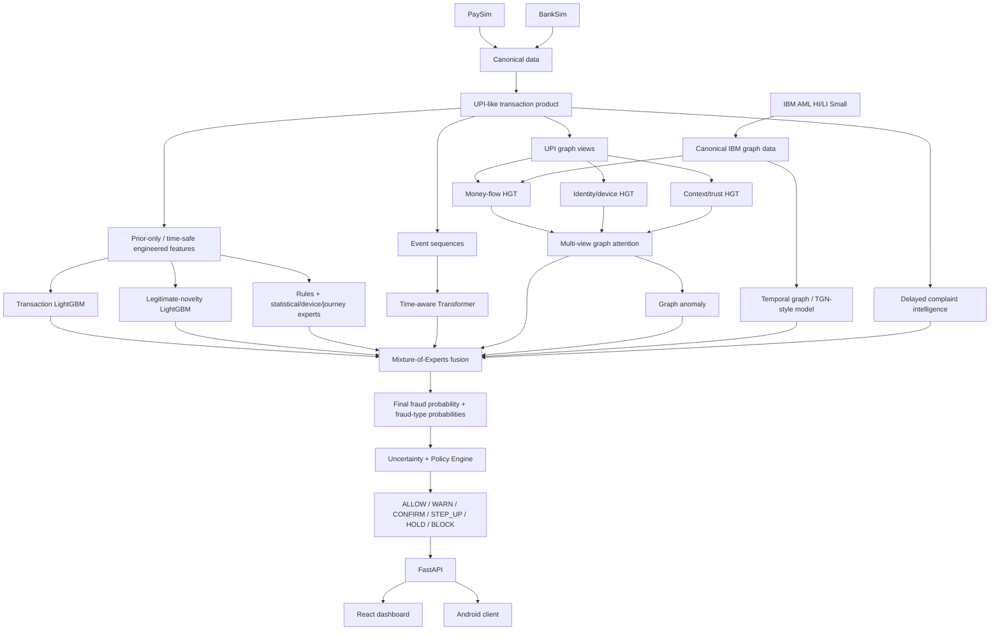

# UPI Fraud Intent Firewall

A multi-source, multi-expert research prototype for **pre-authorisation UPI-style fraud-risk detection**. The project is designed to answer two questions at the same time:

> **Does this payment look risky?**
>
> **Is there a legitimate reason why it looks unusual?**

Instead of treating every large amount, new recipient, unusual location or high-fan-in recipient as fraud, the system combines transaction behaviour, legitimate-context evidence, device/session state, temporal user behaviour, recipient/network structure, complaint intelligence, anomaly detection, deterministic safety rules and a learned mixture-of-experts fusion model.

The repository also contains:

- a **FastAPI** scoring service;
- **Redis** for online feature/risk snapshots;
- **Kafka** for transaction, telemetry and feedback streams;
- a **React + TypeScript intelligence dashboard**;
- a small **Android telemetry/payment-journey simulator**;
- reproducible multi-source data preparation from **PaySim, BankSim and IBM AML Small**.

> **Research-only warning**
>
> This is an educational/research prototype. It is **not connected to NPCI, a bank, or a production UPI switch**, and the reported metrics are from public/synthetic research data. `BLOCK`, `HOLD`, `STEP_UP`, etc. are prototype policy recommendations, not real banking actions.

---

## 1. Project idea in one picture



The design has three timing paths:

1. **Precheck** — when a QR/recipient is selected, inspect cached recipient/complaint/network risk before payment confirmation.
2. **Fast scoring** — immediately before authorisation, combine tabular models, rules, current context and cached graph/sequence intelligence.
3. **Near-real-time intelligence** — heavier graph/sequence workers update reusable intelligence in the background so the next synchronous payment does not need to rebuild the entire graph or sequence model.

---

## 2. Repository structure

```text
UPI_Fraud_Detection/
├── android-client/                # Android research telemetry/payment simulator
├── configs/                       # Feature lists, model config, rules, thresholds
├── dashboard/                     # Legacy Streamlit dashboard (not the recommended UI)
├── docs/                          # Detailed architecture/data/runbook documentation
├── frontend/                      # Current React + TypeScript intelligence console
├── notebooks/                     # Model/data exploration notebooks
├── scripts/                       # Data download, verification, demos, validation
├── src/
│   ├── api/                       # FastAPI endpoints
│   ├── data/                      # Canonicalisation, loading, splitting, preparation
│   ├── features/                  # Transaction/behaviour/context/graph features
│   ├── fusion/                    # Online scoring service
│   ├── geospatial/                # Location/journey helpers
│   ├── graph/                     # Heterogeneous/temporal graph construction
│   ├── intelligence/              # Complaint intelligence
│   ├── models/                    # LightGBM, Transformer, HGT, TGN, fusion, anomaly
│   ├── monitoring/                # Metrics
│   ├── policy/                    # Final action policy
│   ├── rules/                     # Deterministic risk/protective rules
│   ├── schemas/                   # API schemas
│   ├── simulation/                # UPI augmentation, scenarios, recipient profiles
│   ├── streaming/                 # Kafka producers/consumers
│   ├── telemetry/                 # App/device telemetry features
│   └── training/                  # Train/evaluate/cache-loading entry points
├── tests/
├── docker-compose.yml             # Redis + Kafka
├── pyproject.toml
├── requirements.txt
└── README.md
```

The current recommended UI is **`frontend/` (React)**. The old `dashboard/` Streamlit code is retained only as a legacy interface.

---

# 3. Data strategy

## Why multiple datasets are used

There is no public dataset that simultaneously contains representative labelled UPI transactions, device state, QR/collect flows, user-session sequences, recipient networks, complaints and geospatial context. The project therefore uses a **composite research-data strategy**:

| Source | Role in this project | Important limitation |
|---|---|---|
| **PaySim** | P2P/mobile-money transfer behaviour and source fraud labels | Simulated mobile money, not real UPI |
| **BankSim** | Customer-to-merchant behaviour, merchant categories and legitimate high-frequency recipients | Synthetic payment/card-style environment |
| **IBM AML HI-Small / LI-Small** | Money-flow, laundering and mule-like graph structure | AML task, not UPI authorisation |
| **Synthetic UPI augmentation** | QR, collect requests, device state, PIN reset, location, journey, recipient profiles, social-engineering scenarios and hard negatives | Assumptions are synthetic and must be disclosed |
| **Synthetic complaint text** | Complaint/NLP intelligence | Not real customer complaints |

### Current default prototype size

The preparation settings default to approximately:

```text
PaySim          30,000 rows
BankSim         30,000 rows
IBM AML         all laundering rows + sampled legitimate negatives
```

The IBM loader keeps all laundering positives and a controlled sample of legitimate negatives so the graph prototype remains laptop-friendly.

---

# 4. Data preprocessing and augmentation

## 4.1 Download raw data

The repository downloader uses Kaggle datasets:

- PaySim: `ealaxi/paysim1`
- BankSim: `ealaxi/banksim1`
- IBM AML: `ealtman2019/ibm-transactions-for-anti-money-laundering-aml`

Expected raw layout:

```text
data/raw/
├── paysim/
│   └── PS_20174392719_1491204439457_log.csv
├── banksim/
│   └── <BankSim transaction CSV>
└── ibm_aml/
    ├── HI-Small_Trans.csv
    ├── HI-Small_Patterns.txt
    ├── LI-Small_Trans.csv
    └── LI-Small_Patterns.txt
```

## 4.2 Canonicalise each source separately

Each source is converted into a common schema such as:

```text
transaction_id
timestamp
payer_id
payee_id
amount
currency
payment_channel
merchant_category
source_dataset
source_partition
transaction_fraud_label
laundering_label
```

Entity IDs are source-prefixed (`PS_...`, `BS_...`, `IBM_...`) so unrelated accounts from different datasets cannot accidentally collide.

The original source labels remain separate:

- PaySim/BankSim transaction fraud → `transaction_fraud_label`
- IBM AML laundering → `laundering_label`

A laundering label is **not silently treated as the same task as ordinary transaction fraud**.

Canonical outputs:

```text
data/processed/canonical/
├── paysim_transactions.parquet
├── banksim_transactions.parquet
├── ibm_hi_small_transactions.parquet
└── ibm_li_small_transactions.parquet
```

## 4.3 Build the main UPI-like transaction product

The main row-based ML product combines **PaySim + BankSim**, then adds UPI-specific context:

```text
PaySim canonical ──┐
                   ├──> common transaction table
BankSim canonical ─┘
                            ↓
                  stable recipient profiles
                            ↓
                    UPI scenario injection
                            ↓
             behavioural/context/graph features
                            ↓
       upi_transaction_training.parquet
```

IBM AML is **not simply appended as ordinary UPI transactions**. It is kept as a separate money-flow graph product for graph training.

## 4.4 Stable recipient profiles

A major leakage/realism fix is that a payee receives one persistent profile instead of changing identity randomly row by row.

Examples:

```text
personal
merchant
transport_provider
hospital
hotel
gig_worker
new_business
money_mule
qr_scam_recipient
collect_scam_recipient
remote_scam_recipient
compromised_merchant
```

A fraud-profile recipient can behave legitimately for a **warm-up period** and then cross a chronological compromise/activation point. This makes the history more realistic:

```text
legitimate-looking history → activation/compromise → fraudulent behaviour
```

`recipient_consistency.parquet` is produced as a data-quality check and the preparation step fails if a payee is assigned inconsistent persistent profiles/archetypes.

## 4.5 Fraud and legitimate-novelty labels

Two important labels must not be confused:

| Case | `is_fraud` | `is_legitimate_novelty` |
|---|---:|---:|
| Familiar/ordinary legitimate payment | 0 | 0 |
| Unusual but genuinely legitimate hard negative | 0 | 1 |
| Fraud | 1 | 0 |

`is_legitimate_novelty=1` therefore does **not** mean “all legitimate transactions”. It specifically means **unusual-but-legitimate**.

Legitimate hard-negative scenarios include:

```text
auto_long_distance_legitimate
hospital_emergency_legitimate
travel_hotel_legitimate
gig_worker_payment_legitimate
new_merchant_legitimate
legitimate_split_payment
```

Fraud scenarios include:

```text
fake_refund_qr
collect_request_scam
account_takeover
mule_directed
remote_access_scam
```

Original PaySim/BankSim fraud labels are preserved when recipient-aware scenarios are assigned, while additional controlled UPI-specific attack scenarios can also be injected into otherwise non-fraud source rows.

## 4.6 Synthetic UPI context

The augmentation creates fields that public datasets do not provide, including combinations of:

- QR vs P2P/P2M/collect payment mode;
- verified/unverified QR;
- first-time payee;
- device age and whether the device is known;
- SIM age and app-registration age;
- recent PIN reset;
- app re-registration;
- remote-access and overlay indicators;
- Play Integrity placeholder;
- payer/payee location and proximity;
- location continuity and journey plausibility;
- recipient account age;
- recipient archetype and merchant-category consistency;
- complaint prior;
- fraud-type labels such as ATO, QR deception, mule-directed payment and remote-access fraud.

The simulator intentionally adds overlap and hard negatives. For example, genuine users may change phones, genuine merchants may have high fan-in, and a compromised merchant can still look merchant-like.

## 4.7 Leakage-safe historical features

Behavioural and graph-flow features are calculated **before the current transaction is inserted into history**.

Examples:

```text
txn_count_5m
txn_count_1h
amount_sum_1h
unique_payees_1h
time_since_previous_sec
amount_robust_z
fan_in_1h
fan_out_1h
rapid_outflow_ratio
median_holding_minutes
recipient_account_age_days
```

This prevents the current transaction or future activity from being used as if it were already known before authorisation.

The robust amount deviation is approximately:

```text
amount_robust_z =
(current_amount - prior_median) / (1.4826 × prior_MAD + epsilon)
```

## 4.8 Context features

A context support score is also constructed from signals such as location continuity, proximity, stable device, absence of remote access, QR verification, merchant consistency, account age and integrity.

A `novel_transaction_flag` is activated when the transaction is unusual because of factors such as:

```text
new payee
OR |amount_robust_z| >= 2.5
OR distance_from_usual_km >= 10
```

The separate legitimate-novelty model is trained primarily on this novel subset.

## 4.9 IBM AML graph product

IBM HI-Small and LI-Small are separately canonicalised. The IBM loader retains all laundering rows and samples legitimate negatives.

The graph product adds prior-only flow features and is saved as:

```text
data/processed/aml_graph_edges.parquet
```

In the current training code:

- **IBM HI-Small** is combined with train-period UPI-like rows for the money-flow graph expert;
- **IBM LI-Small** remains separately prepared/available and is not included in the reported UPI-like test-set metrics.

## 4.10 Train / validation / test split

The main PaySim+BankSim UPI-like product is split **source-wise and chronologically**:

```text
within PaySim:  70% train → 15% validation → 15% test
within BankSim: 70% train → 15% validation → 15% test
```

The source partitions are then combined, retaining time order within each source.

This gives:

```text
data/processed/train.parquet
data/processed/validation.parquet
data/processed/test.parquet
```

The intended roles are:

```text
TRAIN       → learn the base specialists
VALIDATION  → early stopping, fusion/meta-learning, fraud-type threshold calibration
TEST        → final held-out evaluation
```

---

# 5. Important generated data products

| File | Meaning |
|---|---|
| `upi_transaction_training.parquet` | Main pre-model transaction/features/labels table |
| `train.parquet` | Base-model training rows |
| `validation.parquet` | Validation/fusion-training period |
| `test.parquet` | Final held-out UPI-like evaluation rows |
| `edge_cases.parquet` | Curated representative difficult legitimate and fraud scenarios |
| `events.parquet` | Event-sequence representation used by the Transformer |
| `aml_graph_edges.parquet` | IBM-derived money-flow graph product |
| `recipient_archetype_training.parquet` | Recipient/merchant/mule-focused auxiliary product |
| `recipient_consistency.parquet` | Audit that stable recipient identity was preserved |
| `raw_complaints.parquet` | Synthetic human-language complaint reports |
| `structured_complaints.parquet` | Complaint text converted into structured scam indicators |
| `fusion_training.parquet` | Validation rows after specialist scores are generated; trains fusion |
| `scored_transactions.parquet` | Full table containing specialist outputs, fusion outputs, uncertainty and actions |
| `scored_transactions.pkl` | Pickle version used by the React exporter |
| `models/graph/recipient_scores.parquet` | Train-cutoff recipient intelligence snapshot for online Redis loading |

---

# 6. Model methodology

The system is intentionally **not one giant model**. Different specialists receive different views of the same underlying transaction population and answer narrower questions.

## 6.1 Deterministic rules expert

`src/rules/engine.py`

Risk rules include examples such as:

- known mule recipient;
- remote access during a collect request;
- very new device + recent PIN reset + new payee;
- unverified QR + high complaint intelligence;
- impossible travel.

Protective rules include:

- verified merchant + stable device;
- plausible journey + physical proximity;
- verified self-transfer.

The engine returns:

```text
risk_delta
hard_action
reason_codes
protective_codes
```

The non-negative rule-risk component becomes one fusion expert, while `BLOCK`/`HOLD`/`STEP_UP` hard actions can also be preserved for the final policy layer.

## 6.2 Statistical anomaly expert

A fast deterministic anomaly score combines three ideas:

```text
60% amount abnormality
25% very recent transaction velocity
15% location discontinuity
```

It provides `statistical_anomaly` without requiring a learned model.

## 6.3 Transaction-risk LightGBM

`src/models/lightgbm_model.py`

This expert asks:

> **Does this transaction itself look fraudulent given its current and historical tabular context?**

Its configured feature set is in `configs/features.yaml` and currently includes:

```text
amount
log_amount
hour
is_weekend
is_new_payee
collect_request
qr_verified
recent_pin_reset
app_reregistered
remote_access_indicator
overlay_indicator
device_age_days
sim_age_days
app_registration_age_days
distance_from_usual_km
journey_plausibility
payer_payee_proximity_km
txn_count_5m
txn_count_1h
amount_sum_1h
unique_payees_1h
amount_robust_z
time_since_previous_sec
merchant_category_consistency
recipient_account_age_days
play_integrity_ok
```

Target:

```text
is_fraud
```

Output:

```text
transaction_fraud_score
```

Conceptually LightGBM learns an additive ensemble of trees:

```text
F(x) = sum(tree_m(x))
P(fraud | x) = sigmoid(F(x))
```

## 6.4 Legitimate-novelty / context LightGBM

`src/models/context_model.py`

This is deliberately a separate classifier. It asks:

> **If a transaction is unusual, does its surrounding context look legitimately unusual rather than malicious?**

Configured inputs:

```text
is_new_payee
qr_verified
device_known
recent_pin_reset
app_reregistered
remote_access_indicator
overlay_indicator
journey_plausibility
payer_payee_proximity_km
merchant_category_consistency
recipient_account_age_days
location_continuity
play_integrity_ok
amount_robust_z
distance_from_usual_km
```

Training target:

```text
is_legitimate_novelty
```

Output:

```text
legitimate_novelty_score
```

For fusion, the direction is inverted so that higher means more dangerous:

```text
legitimate_novelty_inverse = 1 - legitimate_novelty_score
```

## 6.5 Device/session risk

A compact deterministic device score combines unknown/new device, PIN reset, app re-registration, remote-access indicator, overlay indicator and integrity state.

It contributes:

```text
device_session_risk
```

## 6.6 Time-aware Transformer

`src/models/time_transformer.py`

The Transformer does not read one flat transaction row. Each transaction is expanded into an ordered event journey in:

```text
data/sequences/events.parquet
```

Example sequence:

```text
APP_OPEN
→ LOGIN
→ NEW_DEVICE_LOGIN
→ PIN_RESET
→ NEW_PAYEE_ADDED
→ AMOUNT_ENTERED
→ PIN_SCREEN_OPENED
→ PAYMENT_CONFIRMED
```

Each event also contains eight numeric features:

```text
delta_seconds
amount
new_device
new_payee
collect_request
qr_unverified
remote_access
location_inconsistent
```

The model combines event-type embeddings, numeric projections and positional information, applies a Transformer encoder, pools the sequence and uses two heads.

Outputs:

```text
sequence_account_takeover_score
sequence_social_engineering_score
sequence_history_size
```

## 6.7 Three HGT graph views

The system constructs three heterogeneous graph views from training-period information.

### Money-flow view

```text
account --pays--> account
```

Captures transfer structure, fan-in/fan-out and laundering/mule-like topology. Train-period UPI-like transactions are supplemented with IBM HI-Small money-flow data.

### Identity/device view

Typical relationships:

```text
user --owns--> account
user --uses--> device
device --connects_from--> IP/ASN
account --owns--> VPA
```

### Context/trust view

Typical relationships:

```text
account --owns--> VPA
VPA --belongs_to--> merchant
QR --resolves_to--> VPA
account --occurred_in--> H3 location
complaint --flags--> account
```

Each HGT produces a learned **32-dimensional account embedding**. The embedding is a compressed learned representation of what the account/network neighbourhood looks like; its dimensions are latent rather than manually named.

## 6.8 Multi-view graph attention

`src/models/multiview_attention.py`

The money, identity and context embeddings are not simply averaged. A transaction-conditioned attention model receives the three 32D graph embeddings plus an 8-value transaction query containing concepts such as amount, new-payee state, QR/collect mode, journey plausibility, device risk, complaint intelligence and account age.

In simplified form:

```text
attention_weight_j = softmax(score(view_j, current_transaction_query))

fused_graph_embedding =
    weight_money    × money_embedding
  + weight_identity × identity_embedding
  + weight_context  × context_embedding
```

Outputs include:

```text
multiview_mule_score
graph_merchant_score
fused_graph_embedding
money_view_weight
identity_view_weight
context_view_weight
```

## 6.9 Temporal graph / TGN-style model

`src/models/hetero_tgn.py`

This compact temporal graph encoder processes historical transfer messages in time order. Numeric message fields include:

```text
log_amount
is_qr
is_collect
recipient_complaint_score
rapid_outflow_ratio
location_continuity
```

Relation embeddings, numeric features and time-gap encodings are passed through a GRU-style memory.

Critically, the current transaction is scored from **prior recipient history before it is appended to history**.

Outputs include:

```text
tgn_mule_score_prior
tgn_rapid_outflow_score_prior
tgn_history_size
```

## 6.10 Composite graph-mule risk

The final scalar graph-mule expert combines static graph, temporal graph and explicit historical flow evidence:

```text
graph_mule_score =
    0.45 × multiview_mule_score
  + 0.35 × tgn_mule_score_prior
  + 0.20 × historical_flow_risk
```

This avoids treating one graph architecture as the sole authority.

## 6.11 Graph anomaly detector

`src/models/anomaly_model.py`

An Isolation Forest is fitted on the fused graph embeddings from the training period.

Output:

```text
graph_anomaly_score
```

This answers a different question from mule classification:

> **Does this network position look structurally unusual even if it does not match a known labelled pattern?**

## 6.12 Complaint intelligence

Synthetic complaints are generated after transaction time and are processed into structured fields such as scam type, refund claim, remote-access mention, collect-request mention, QR mention and confidence.

The model uses complaints **as-of the transaction time** so future complaints do not leak backward into earlier decisions.

Fusion receives:

```text
complaint_intelligence_score
```

The optional OpenAI extractor is asynchronous and is not itself allowed to approve or block a payment. A local extractor is available as the default path.

---

# 7. Mixture-of-Experts fusion

`src/models/fusion_model.py`

Fusion receives **12 specialist risk signals**:

```text
rule_risk
statistical_anomaly
transaction_fraud_score
legitimate_novelty_inverse
device_session_risk
sequence_account_takeover_score
sequence_social_engineering_score
graph_mule_score
merchant_legitimacy_inverse
graph_anomaly_score
complaint_intelligence_score
journey_risk
```

It also receives **14 gating/context variables** that tell it when specialist evidence is available and trustworthy:

```text
is_new_payee
collect_request
is_qr
device_changed
graph_neighbourhood_size
recipient_archetype_code
missing_feature_ratio
graph_score_available
sequence_score_available
complaint_score_available
recipient_history_available
payer_history_available
cache_coverage
expert_conflict_score
```

The gate produces transaction-specific expert weights:

```text
weights = softmax(Gate(gating_features))
weighted_score = sum(weights_i × expert_i)
```

A second nonlinear context branch sees all expert and gating values:

```text
context = MLP([experts, gating_features])
combined = [weighted_score, context]
```

Two heads then produce:

1. **overall fraud probability**;
2. **seven fraud-type probabilities**:

```text
account takeover
social engineering
QR deception
collect scam
mule-directed payment
transaction splitting
remote-access fraud
```

Fusion is trained on **validation-period specialist outputs**, rather than simply reusing the base models' training rows. Training is augmented with deliberately missing caches and contradictory expert evidence so the fusion model learns that, for example, a missing graph score is not the same as a confidently safe graph score.

Fraud-type thresholds are calibrated on the validation set by searching for the best F1 operating threshold for each type.

---

# 8. Uncertainty and final policy

## Uncertainty

The custom uncertainty score combines:

```text
35% expert disagreement
25% entropy of final probability
15% missing-feature ratio
10% graph sparsity
15% graph anomaly
```

This separates:

```text
what the model thinks       → fraud probability
how sure the system is      → uncertainty
```

## Final Policy Engine

`src/policy/decision_engine.py`

The final operational decision is **not produced directly by the classifier**. The Policy Engine considers:

```text
final fraud risk
uncertainty
legitimate-context score
graph-mule score
account-takeover score
transaction-model score
graph anomaly
social-engineering score
whether an unverified QR is involved
hard rule action
```

Current policy thresholds:

```text
BLOCK risk                 0.92
HOLD risk                  0.82
STEP_UP risk               0.65
WARN risk                  0.42
high uncertainty           0.62
high legitimate context    0.80
high mule risk             0.78
high ATO risk              0.85
```

Additional runtime specialist guardrails require combinations of strong evidence before overriding the ordinary probability ladder.

Possible actions:

```text
ALLOW
WARN
CONFIRM
STEP_UP
HOLD
BLOCK
```

This design separates **risk estimation** from **operational policy**.

---

# 9. Online architecture: Redis, Kafka and FastAPI

## Redis

Redis holds reusable payer, recipient, transaction-time, graph and sequence features so the synchronous `/score` request can perform fast lookups instead of retraining/rebuilding heavy models.

## Kafka

Kafka supports streaming transaction/telemetry/feedback flows. The repository includes:

```text
src.streaming.feature_consumer
src.streaming.feedback_consumer
src.streaming.producer
```

## FastAPI endpoints

| Endpoint | Purpose |
|---|---|
| `GET /health` | Service/model health |
| `POST /telemetry` | Ingest app/session telemetry |
| `POST /precheck` | Early recipient/QR check before final payment |
| `POST /score` | Full pre-authorisation risk decision |
| `POST /complaint` | Structure complaint text/update intelligence |
| `POST /feedback` | Record later confirmed outcome/analyst feedback |
| `GET /transaction/{transaction_id}` | Retrieve a prior decision |
| `GET /entity/{entity_type}/{entity_id}` | Inspect cached entity features/risk |
| `GET /metrics` | Prometheus-compatible metrics |

The `/score` response contains the final fraud probability, legitimate-novelty probability, uncertainty, detected fraud types, recommended action, reason codes, specialist model scores and latency.

---

# 10. React intelligence dashboard

The current dashboard is in:

```text
frontend/
```

It is a **presentation layer only**. It does not replace the Python models, API, Redis, Kafka, policy or training pipeline.

The React UI includes:

- **Command Center** — run live scoring/precheck and inspect the final decision;
- **Executive / Technical modes** — simple explanation vs raw technical request/response detail;
- **Edge-Case Gallery** — representative held-out legitimate and fraud scenarios;
- **Model Debate** — shows suspicious versus protective specialist evidence;
- **What-If Lab** — changes fast-path inputs and re-scores a historical reference transaction;
- **Recipient Graph** — visualises the selected recipient's transaction-time neighbourhood;
- **Transaction Timeline** — shows the payer's recent transaction journey;
- **Performance** — reads current metrics/evaluation JSON;
- **Leakage Guards** — explains time-order and future-information protections;
- **Architecture** — end-to-end model flow;
- **Complaint Lab** — exercises the existing `/complaint` endpoint;
- API/Redis/model health indicators.

The frontend exporter reads `data/processed/scored_transactions.pkl`, uses the held-out test IDs when available, creates representative scenario JSON, transaction-time graph/timeline JSON, recent decisions, and copies model metrics into `frontend/public/`.

The What-If Lab is a **counterfactual stress test**, not a fresh independent held-out observation: it keeps a historical `reference_transaction_id` so cached historical graph/sequence context remains anchored to that transaction while selected request fields are changed.

---

# 11. Android client

The Android project is in:

```text
android-client/
```

It is a **research telemetry/payment-journey simulator**, not a real UPI app.

The current Kotlin client provides fields for:

```text
API URL
payer ID
payee ID
amount
first-time payee toggle
verified-QR toggle
recent PIN reset toggle
simulated remote-access-risk toggle
```

It has three buttons:

### Send Telemetry Event

Calls:

```text
POST /telemetry
```

and sends a payment-journey event such as `RECIPIENT_NAME_VIEWED`, session/device IDs, optional current location, amount and recipient ID.

### Run Recipient Precheck

Calls:

```text
POST /precheck
```

This represents an **early check before final authorisation**, allowing recipient/network/complaint warnings to appear before money would move.

### Score Before Payment

Calls:

```text
POST /score
```

This submits a full simulated transaction and displays the returned HTTP status and JSON decision.

The demo transaction currently uses QR mode and fixed prototype defaults for several fields while exposing selected risk signals through UI toggles.

The app requests coarse/fine location permission and uses the most recent available location only if permission is granted. `remote_access_indicator` is intentionally a simulation toggle; ordinary Android apps cannot reliably inspect every other running application. `play_integrity_ok` is currently a prototype boolean rather than a complete Google Play Integrity server-verification integration.

---

# 12. Current checked-in evaluation snapshot

The React `frontend/public` folder currently contains the following held-out test snapshot:

| Metric | Value |
|---|---:|
| Held-out test rows | 9,000 |
| Fraud prevalence | 6.32% |
| Final PR-AUC / Average Precision | **0.9753** |
| Final ROC-AUC | **0.9973** |
| Brier score | **0.00874** |
| Legitimate-novelty FPR at 0.50 | **0.473%** |
| Legitimate-novelty BLOCK/HOLD rate | **0.344%** |
| Transaction-model PR-AUC | 0.9383 |
| Transaction-model ROC-AUC | 0.9911 |
| Context-model PR-AUC | 0.9701 |

Fraud-type PR-AUC snapshot:

| Type | PR-AUC |
|---|---:|
| Account takeover | 0.9247 |
| Social engineering | 0.9753 |
| QR deception | 0.9054 |
| Collect scam | 0.9200 |
| Mule-directed | 0.9333 |
| Transaction splitting | 0.4472 |
| Remote-access fraud | 0.9944 |

These are **research results on the repository's held-out public/synthetic test environment**. They must not be presented as production UPI performance. Transaction splitting is visibly the weakest fraud-type head and remains an improvement target.

---

# 13. Requirements

Recommended local development environment:

- **Python 3.11** (the project supports Python `>=3.11,<3.15`);
- 64-bit Python;
- **Docker Desktop** for Redis/Kafka;
- **Node.js 22+** and npm for the React frontend;
- **Android Studio + JDK 17 + Android SDK 36** for the Android client;
- 16 GB RAM minimum for the prototype; more is useful for graph experiments;
- NVIDIA GPU optional — the code can run on CPU, but deep/graph training is slower.

---

# 14. Full start-to-finish run — Windows PowerShell

The commands below assume Windows PowerShell and Python 3.11.

## Step 1 — Clone the repository

```powershell
git clone https://github.com/anvayborade/UPI_Fraud_Detection.git
cd UPI_Fraud_Detection
```

## Step 2 — Create and activate the Python environment

```powershell
py -3.11 -m venv .venv
.\.venv\Scripts\Activate.ps1
py -3.11 -m pip install --upgrade pip
```

If PowerShell blocks local activation scripts for the current session, you can use:

```powershell
Set-ExecutionPolicy -Scope Process -ExecutionPolicy Bypass
.\.venv\Scripts\Activate.ps1
```

## Step 3 — Install PyTorch and Python dependencies

Install the appropriate PyTorch build for your CPU/CUDA system using the official selector:

<https://pytorch.org/get-started/locally/>

Then:

```powershell
py -3.11 -m pip install -r requirements.txt
```

Quick environment check:

```powershell
py -3.11 -c "import torch, torch_geometric, lightgbm, pyarrow; print('torch', torch.__version__); print('cuda', torch.cuda.is_available())"
```

Optional quick tests:

```powershell
py -3.11 -m compileall src
py -3.11 scripts/smoke_test.py
py -3.11 -m pytest -q
```

## Step 4 — Configure Kaggle

Install/configure Kaggle if required:

```powershell
py -3.11 -m pip install kaggle
```

In Kaggle, create an API token and place `kaggle.json` under:

```text
C:\Users\YOUR_USERNAME\.kaggle\kaggle.json
```

Test it:

```powershell
kaggle datasets list -s paysim
```

## Step 5 — Download all required datasets

```powershell
py -3.11 scripts/download_data.py all
```

Verify them:

```powershell
py -3.11 scripts/verify_multisource_data.py
```

## Step 6 — Prepare the multi-source data

Recommended first full prototype:

```powershell
py -3.11 -m src.data.prepare_multisource `
  --paysim-rows 30000 `
  --banksim-rows 30000 `
  --ibm-negative-ratio 10 `
  --ibm-max-negatives-per-file 20000
```

Inspect the generated manifest:

```powershell
Get-Content data\processed\source_manifest.json
```

Optional quick inspection:

```powershell
py -3.11 -c "import pandas as pd; d=pd.read_parquet('data/processed/upi_transaction_training.parquet'); print(d.shape); print(d['source_dataset'].value_counts()); print(d['scenario'].value_counts())"
```

## Step 7 — Train the complete model stack

Local complaint extractor (recommended first run):

```powershell
py -3.11 -m src.training.train_all --skip-prepare
```

This runs the current training pipeline in source-code order: transaction LightGBM, legitimate-novelty LightGBM, sequence Transformer, delayed/time-aware complaint intelligence, three HGT graph views, multi-view graph attention, temporal graph/TGN-style scoring, graph anomaly detection, rules/statistical/journey experts, validation-period Mixture-of-Experts fusion, fraud-type threshold calibration, uncertainty, and final policy actions.

### Optional LLM complaint extraction

The project does not require an `.env` file for the default local run. If you explicitly want the optional OpenAI complaint extractor, create a `.env` file in the repository root containing:

```text
OPENAI_API_KEY=your_key_here
OPENAI_MODEL=your_model_here
```

Then run:

```powershell
py -3.11 -m src.training.train_all --skip-prepare --use-llm
```

Do not commit `.env` or API keys to Git.

## Step 8 — Evaluate the trained system

```powershell
py -3.11 -m src.training.evaluate
```

Important outputs include:

```text
models/metrics.json
models/evaluation_report.json
data/processed/fusion_training.parquet
data/processed/scored_transactions.parquet
data/processed/scored_transactions.pkl
models/graph/recipient_scores.parquet
```

## Step 9 — Start Redis and Kafka

Docker Desktop must be running.

```powershell
docker compose up -d
docker compose ps
```

Expected local ports:

```text
Redis   localhost:6379
Kafka   localhost:9092
```

## Step 10 — Load trained online snapshots into Redis

Run this after infrastructure is running and after a fresh training run:

```powershell
py -3.11 -m src.training.load_online_cache
```

If you merely restarted Docker and the Redis volume still contains the required snapshots, reloading is not always necessary.

## Step 11 — Start the FastAPI service

Open a new PowerShell terminal in the repository root, activate the same virtual environment, then:

```powershell
py -3.11 -m uvicorn src.api.main:app --host 0.0.0.0 --port 8000 --reload
```

Open:

```text
API docs:  http://localhost:8000/docs
Health:    http://localhost:8000/health
Metrics:   http://localhost:8000/metrics
```

## Step 12 — Start the near-real-time workers

Use separate terminals, each with the same virtual environment activated.

### Terminal A — rolling feature consumer

```powershell
py -3.11 -m src.streaming.feature_consumer
```

### Terminal B — graph refresh worker

```powershell
py -3.11 -m src.graph.graph_worker --interval-seconds 60
```

### Terminal C — feedback consumer

```powershell
py -3.11 -m src.streaming.feedback_consumer
```

These workers are most useful for the full streaming demonstration. For a basic historical dashboard demo, the preloaded Redis snapshots and API are the key requirements.

## Step 13 — Export data for the React dashboard

After training/evaluation, open another terminal:

```powershell
cd frontend
npm install
py -3.11 scripts/export_frontend_data.py
```

The exporter creates/refreshes browser-readable files under:

```text
frontend/public/
```

Re-run the exporter after retraining if you want the UI to reflect the new scored data and metrics.

## Step 14 — Start the React dashboard

Still inside `frontend/`:

```powershell
npm run dev
```

Open:

```text
http://localhost:5173
```

### Convenience launcher

On Windows you can instead run:

```powershell
cd frontend
.\start_ui.ps1
```

It exports the current frontend data, runs `npm install` when `node_modules` is absent, and starts Vite.

> The old Streamlit command is no longer the recommended dashboard. Use the React frontend on port **5173**.

## Step 15 — Run demo API scenarios

Back in the repository root:

```powershell
py -3.11 scripts/demo_requests.py auto
py -3.11 scripts/demo_requests.py hospital
py -3.11 scripts/demo_requests.py qr_scam
py -3.11 scripts/demo_requests.py account_takeover
py -3.11 scripts/demo_requests.py mule
```

These exercise the same FastAPI scoring path used by the UI.

## Step 16 — Optional streaming replay

To stream held-out transactions through Kafka:

```powershell
py -3.11 -m src.streaming.producer --input data/processed/test.parquet --limit 200 --sleep 0.05
```

Keep the feature/graph/feedback workers running while doing this.

---

# 15. Run the Android client from start to finish

The Android client has not replaced the React dashboard; it demonstrates what a **mobile payment journey** could send to the same backend.

## Prerequisites

Install:

- Android Studio;
- JDK 17;
- Android SDK / compile SDK 36;
- an Android emulator or a physical Android device.

The project currently uses:

```text
applicationId  com.example.upifraud
minSdk         26
compileSdk     36
targetSdk      36
JVM target     17
OkHttp         4.12.0
```

## Step A — Make sure the backend is running

From the repository root:

```powershell
docker compose up -d
py -3.11 -m src.training.load_online_cache
py -3.11 -m uvicorn src.api.main:app --host 0.0.0.0 --port 8000 --reload
```

For the simplest first Android test, the API is the essential component. The streaming workers can then be added for the complete demonstration.

## Step B — Open the Android project

In Android Studio choose:

```text
Open → <repository>\android-client
```

Do **not** open only the `app/` subfolder; open the `android-client/` project root.

Allow Gradle sync to complete and install any requested Android SDK 36 components.

## Step C — Start an emulator

Create/start an Android Virtual Device with API level 26 or newer.

The app's default API URL is already:

```text
http://10.0.2.2:8000
```

`10.0.2.2` is the Android emulator's special route to the host computer's localhost.

## Step D — Run the app

Press **Run** in Android Studio and choose the emulator.

The app may request location permission. Location is optional; if granted, the most recent device/emulator location is added to telemetry and transaction requests.

## Step E — Test the three buttons

Use a sample payer, payee and amount, then try:

1. **Send Telemetry Event** — should call `/telemetry`.
2. **Run Recipient Precheck** — should call `/precheck` and return early recipient/warning information.
3. **Score Before Payment** — should call `/score` and display the complete JSON risk decision.

Experiment with:

```text
First-time payee
Verified QR
Recent PIN reset
Simulated remote-access risk
```

and observe how the returned decision/reason codes change.

## Physical Android phone instead of emulator

The phone cannot use `10.0.2.2`.

1. Put the phone and development PC on the same network.
2. Find the PC's IPv4 address:

```powershell
ipconfig
```

3. In the app's API URL field use, for example:

```text
http://192.168.1.10:8000
```

4. Keep Uvicorn bound to:

```text
--host 0.0.0.0
```

5. If the phone cannot connect, allow Python/Uvicorn port 8000 through Windows Firewall for the private network.

The current Android manifest permits development cleartext HTTP. Use HTTPS and a production security design for any real deployment.

---

# 16. Minimum quick-start after everything has already been trained

If data/models already exist and you only want to demonstrate the complete system:

### Terminal 1 — infrastructure

```powershell
docker compose up -d
```

### One-time/cache refresh if needed

```powershell
py -3.11 -m src.training.load_online_cache
```

### Terminal 2 — API

```powershell
py -3.11 -m uvicorn src.api.main:app --host 0.0.0.0 --port 8000 --reload
```

### Terminal 3 — feature consumer

```powershell
py -3.11 -m src.streaming.feature_consumer
```

### Terminal 4 — graph worker

```powershell
py -3.11 -m src.graph.graph_worker --interval-seconds 60
```

### Terminal 5 — feedback consumer

```powershell
py -3.11 -m src.streaming.feedback_consumer
```

### Terminal 6 — React dashboard

```powershell
cd frontend
npm run dev
```

Then open:

```text
http://localhost:5173
```

The Android app can be started in parallel and pointed at the same port-8000 API.

---

# 17. Common troubleshooting

## `ModuleNotFoundError`

Make sure you are in the repository root and the virtual environment is active:

```powershell
.\.venv\Scripts\Activate.ps1
```

## PyTorch / PyG problems

Verify:

```powershell
py -3.11 -c "import torch, torch_geometric; print(torch.__version__, torch.cuda.is_available())"
```

If CUDA is required, reinstall the correct PyTorch build for the installed NVIDIA driver/CUDA configuration.

## Kaggle download fails

Check:

```powershell
kaggle datasets list -s paysim
```

and verify `%USERPROFILE%\.kaggle\kaggle.json` exists.

## Redis/Kafka unavailable

```powershell
docker compose ps
docker compose logs redis
docker compose logs kafka
```

## API starts but models are unavailable

Train first:

```powershell
py -3.11 -m src.training.train_all --skip-prepare
```

Then restart the API.

## React dashboard has old scenarios/metrics

```powershell
cd frontend
py -3.11 scripts/export_frontend_data.py
npm run dev
```

## `npm` not found

Install Node.js 22 or newer and restart the terminal.

## Android emulator cannot reach API

Use:

```text
http://10.0.2.2:8000
```

not `http://localhost:8000` inside the emulator.

## Physical phone cannot reach API

Use the development PC's LAN IP, keep the phone/PC on the same network, bind Uvicorn to `0.0.0.0`, and check Windows Firewall.

---

# 18. Tests

Run:

```powershell
py -3.11 -m pytest -q
```

The tests cover API schemas/features and important multi-source, recipient-profile, fusion-runtime, rule and policy behaviours.

---

# 19. Useful files for understanding the project

Suggested reading order:

1. `src/data/prepare_multisource.py`
2. `src/simulation/recipient_profiles.py`
3. `src/simulation/generate_scenarios.py`
4. `configs/features.yaml`
5. `src/models/lightgbm_model.py`
6. `src/models/context_model.py`
7. `src/models/time_transformer.py`
8. `src/graph/build_views.py`
9. `src/models/hgt_model.py`
10. `src/models/multiview_attention.py`
11. `src/models/hetero_tgn.py`
12. `src/models/anomaly_model.py`
13. `src/models/fusion_model.py`
14. `src/rules/engine.py`
15. `src/policy/decision_engine.py`
16. `src/fusion/service.py`
17. `src/api/main.py`
18. `frontend/README.md`
19. `android-client/README.md`

---

# 20. Research boundaries and remaining work

Important limitations of the current prototype:

- PaySim, BankSim and IBM AML are synthetic/public research datasets, not representative production UPI data.
- UPI-specific device, QR, location, sequence and social-engineering fields are simulated.
- Reported performance therefore demonstrates the architecture on the project's held-out research environment, not bank/NPCI production accuracy.
- The temporal graph model is a compact research implementation rather than a distributed industrial TGN.
- The current static HGT implementation focuses on typed graph structure and node features; richer direct use of edge attributes is a future extension.
- Transaction-splitting detection is materially weaker than the other current fraud-type heads.
- The Android remote-access flag is simulated and Play Integrity is represented by a prototype boolean.
- A production deployment would require representative banking data, security review, calibration, drift monitoring, privacy/ethics controls, adversarial testing and integration inside an authorised payment decision flow.

Useful next experiments include stricter recipient-level holdouts, future-time generalisation, source holdouts, calibration curves, threshold-specific precision/recall/F1/specificity, stronger transaction-splitting modelling, improved graph-mule calibration and ablation studies showing the value added by each expert.

---

# 21. Core research question

> **Can a context-aware, uncertainty-aware, multi-expert pre-authorisation fraud system distinguish genuinely unusual payments from malicious intent while retaining strong detection of social-engineering, account-takeover and mule-directed fraud?**

The project's central design principle is:

> **Do not ask only “Is this transaction unusual?” — also ask “Is there a legitimate reason why it is unusual?”**

---

## License

See `LICENSE` in this repository.
